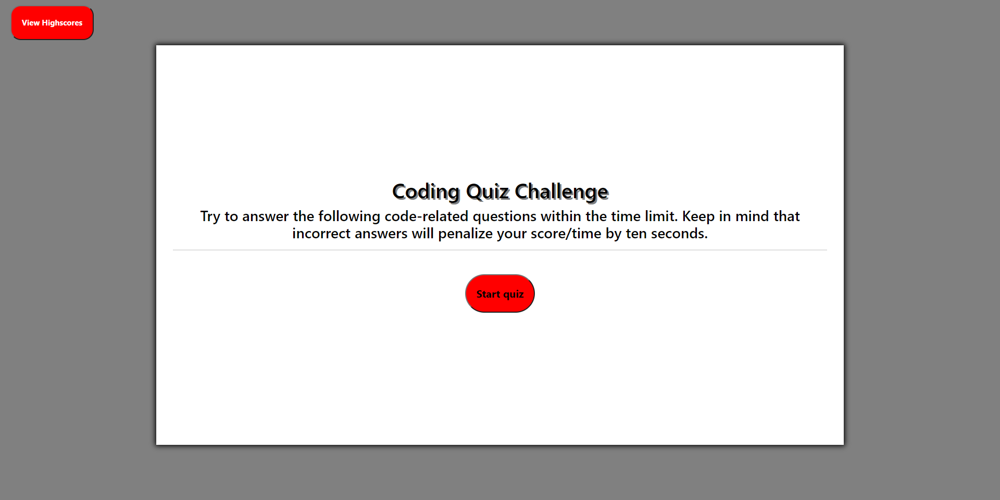
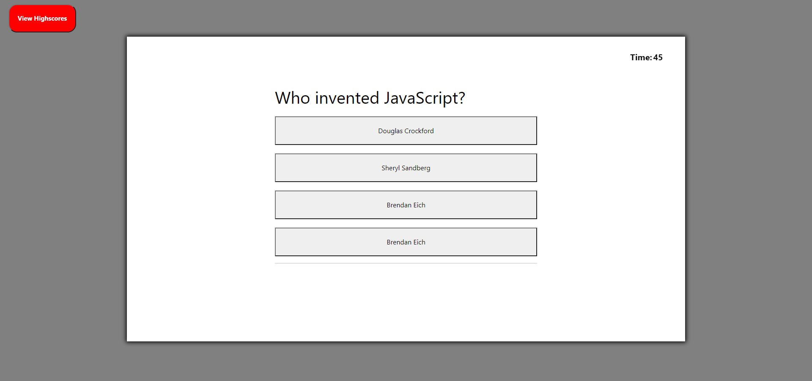

# Code-Quiz
````
At some point in your journey to become a full-stack web developer, you’ll likely be asked to complete a coding assessment perhaps as part of an interview process.
A typical coding assessment includes both multiple-choice questions and interactive coding challenges. 
````

## Description 
A Coding Quiz that lets you test your coding knowledge. When you visit the page you are presented with the instructions and a start button. It's a timer quiz try to answer all the question under the given time or the game will end once the time runs out. Wish you luck!

## technologies Used
- HTML 
- CSS
- JAVASCRIPT

## Links 
- [Github Link](https://github.com/rajveer-s/Code-Quiz)

- [Deployed Link]()

## Screenshot

